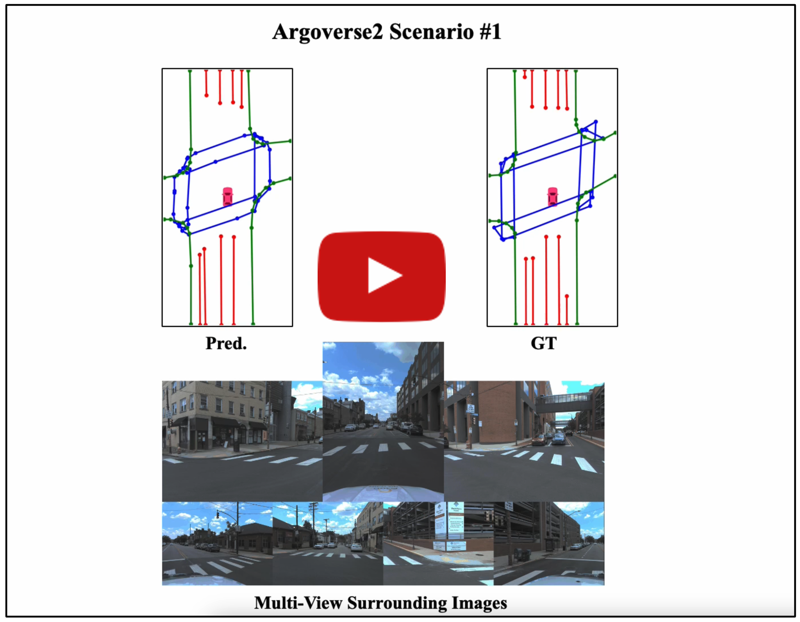
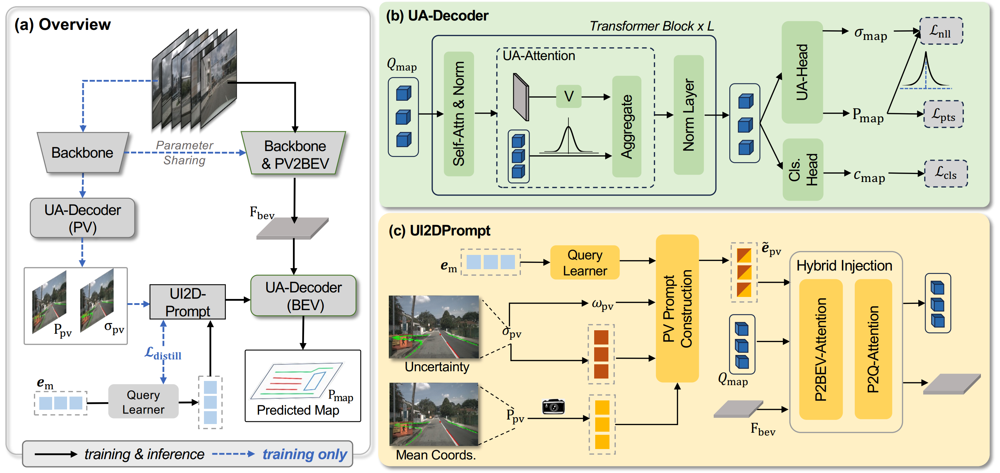

# Uncertainty-Instructed Structure Injection for Generalizable HD Map Construction

> Xiaolu Liu*, Ruizi Yang*, Song Wang, Wentong Li,  Junbo Chen†, Jianke Zhu†
>
> **[[Paper]](https://arxiv.org/pdf/2503.23109) (arXiv). CVPR2025**


## Video Demo

<p align="center"> <a href="https://youtu.be/azgvJtFQCBk"></a> </p>


## Introduction

We propose UIGenMap, an uncertainty-instructed structure injection approach for generalizable HD map vectorization, which concerns the uncertainty resampling in statistical distribution and employs explicit instance features to reduce excessive reliance on training data. 



## Getting Started
### 1. Environment
**Step 1.** Create conda environment and activate it.

```
conda create --name uigenmapnet python=3.8 -y
conda activate uigenmapnet
```

**Step 2.** Install PyTorch.

```
pip install torch==1.9.0+cu111 torchvision==0.10.0+cu111 torchaudio==0.9.0 -f https://download.pytorch.org/whl/torch_stable.html
```

**Step 3.** Install MMCV series.

```
# Install mmcv-series
pip install mmcv-full==1.6.0
pip install mmdet==2.28.2
pip install mmsegmentation==0.30.0
git clone https://github.com/open-mmlab/mmdetection3d.git
cd mmdetection3d
git checkout v1.0.0rc6 
pip install -e .
```

**Step 4.** Install other requirements.

```
pip install -r requirements.txt
```

### 2. nuScenes Dataset Preparation
**Step 1.** Download [NuScenes](https://www.nuscenes.org/download) dataset to `./data/nuScenes`.

**Step 2.** Generate annotation files for NuScenes dataset.

```
python tools/nuscenes_converter.py --data-root ./data/nuScenes --newsplit
```

### 3. Training and Validating
To train a model with 2 GPUs:

```
bash tools/dist_train.sh ${CONFIG} 2
```

To validate a model with 2 GPUs:

```
bash tools/dist_test.sh ${CONFIG} ${CEHCKPOINT} 2 --eval
```


## Acknowledgements

UIGenMap is based on [mmdetection3d](https://github.com/open-mmlab/mmdetection3d). It is also greatly inspired by the following outstanding contributions to the open-source community: [StreamMapNet](https://github.com/yuantianyuan01/StreamMapNet), [MapTR](https://github.com/hustvl/MapTR), [MapUncertaintyPrediction
](https://github.com/alfredgu001324/MapUncertaintyPrediction).

## Citation


If the paper and code help your research, please kindly cite:

```BibTeX
@inproceedings{liu2025uncertainty,
  title={Uncertainty-Instructed Structure Injection for Generalizable HD Map Construction},
  author={Liu, Xiaolu and Yang, Ruizi and Wang, Song and Li, Wentong and Chen, Junbo and Zhu, Jianke},
  booktitle={Proceedings of the Computer Vision and Pattern Recognition Conference},
  pages={22359--22368},
  year={2025}
}
```

​    

